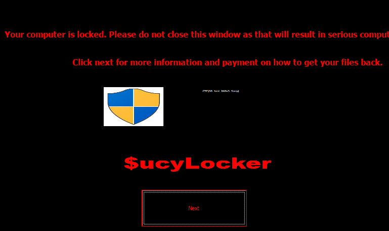
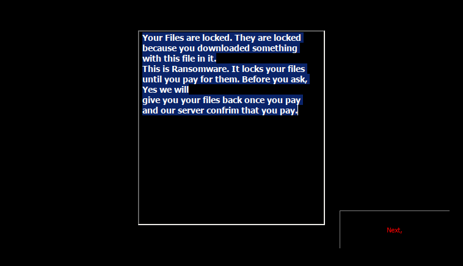
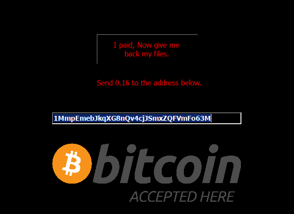

## Step 1: computer name

([source](https://www.aldeid.com/wiki/Volatility/Retrieve-hostname))

```
$ vol3 -f dump.vmem windows.registry.hivelist
Volatility 3 Framework 2.4.1
Progress:  100.00               PDB scanning finished                        
Offset  FileFullPath    File output

0xf8a00000f010          Disabled
0xf8a000024010  \REGISTRY\MACHINE\SYSTEM        Disabled
0xf8a000053320  \REGISTRY\MACHINE\HARDWARE      Disabled
0xf8a000109410  \SystemRoot\System32\Config\SECURITY    Disabled
0xf8a00033d410  \Device\HarddiskVolume1\Boot\BCD        Disabled
0xf8a0005d5010  \SystemRoot\System32\Config\SOFTWARE    Disabled
0xf8a001495010  \SystemRoot\System32\Config\DEFAULT     Disabled
0xf8a0016d4010  \SystemRoot\System32\Config\SAM Disabled
0xf8a00175b010  \??\C:\Windows\ServiceProfiles\NetworkService\NTUSER.DAT        Disabled
0xf8a00176e410  \??\C:\Windows\ServiceProfiles\LocalService\NTUSER.DAT  Disabled
0xf8a002090010  \??\C:\Users\Rick\ntuser.dat    Disabled
0xf8a0020ad410  \??\C:\Users\Rick\AppData\Local\Microsoft\Windows\UsrClass.dat  Disabled
0xf8a00377d2d0  \??\C:\System Volume Information\Syscache.hve   Disabled
```

```
$ vol3 -f dump.vmem windows.registry.printkey --offset 0xf8a000024010 --key 'ControlSet001\Control\ComputerName\ComputerName'
Volatility 3 Framework 2.4.1
Progress:  100.00               PDB scanning finished                        
Last Write Time Hive Offset     Type    Key     Name    Data    Volatile

2018-06-02 19:23:00.000000      0xf8a000024010  REG_SZ  \REGISTRY\MACHINE\SYSTEM\ControlSet001\Control\ComputerName\ComputerName        (Default)       "mnmsrvc"       False
2018-06-02 19:23:00.000000      0xf8a000024010  REG_SZ  \REGISTRY\MACHINE\SYSTEM\ControlSet001\Control\ComputerName\ComputerName        ComputerName    "WIN-LO6FAF3DTFE"       False
```

computer name: ```WIN-LO6FAF3DTFE```

## Step 2: credentials

### Cracking

We can get the ntlm hash for the passwords ([source](https://www.aldeid.com/wiki/Volatility/Retrieve-password)).
```
$ vol3 -f dump.vmem windows.hashdump
Volatility 3 Framework 2.4.1
Progress:  100.00               PDB scanning finished                        
User    rid     lmhash  nthash

Administrator   500     aad3b435b51404eeaad3b435b51404ee        31d6cfe0d16ae931b73c59d7e0c089c0
Guest   501     aad3b435b51404eeaad3b435b51404ee        31d6cfe0d16ae931b73c59d7e0c089c0
Rick    1000    aad3b435b51404eeaad3b435b51404ee        518172d012f97d3a8fcc089615283940
```

```518172d012f97d3a8fcc089615283940``` -> Rick's pwd

The lmhash is an empty string.

Could not crack it using [crackstation](https://crackstation.net/) or [hashcat](https://cyberloginit.com/2017/12/26/hashcat-ntlm-brute-force.html).

cracking it does not seem to be possible

### LSA

"it seems more than likely that the hash, or password, will also be stored in memory. In fact, there are quite a few password crackers that take your password directly from memory." - [source](https://security.stackexchange.com/a/113298)

From ```volatility3 -h```:
```
 windows.lsadump.Lsadump
                        Dumps lsa secrets from memory
```
```
$ vol3 -f dump.vmem windows.lsadump
Volatility 3 Framework 2.4.1
Progress:  100.00               PDB scanning finished                        
Key     Secret  Hex

DefaultPassword (MortyIsReallyAnOtter   28 00 00 00 00 00 00 00 00 00 00 00 00 00 00 00 4d 00 6f 00 72 00 74 00 79 00 49 00 73 00 52 00 65 00 61 00 6c 00 6c 00 79 00 41 00 6e 00 4f 00 74 00 74 00 65 00 72 00 00 00 00 00 00 00 00 00
DPAPI_SYSTEM    ,6©Uá   àcL tcØ KEZä¼òw¥%?G
                                           åM¥È5ÏÜ      2c 00 00 00 00 00 00 00 00 00 00 00 00 00 00 00 01 00 00 00 36 9b ba a9 55 e1 92 82 09 e0 63 4c 20 74 63 14 9e d8 a0 4b 45 87 5a e4 bc f2 77 a5 25 3f 47 12 0b e5 4d a5 c8 35 cf dc 00 00 00 00
```

Password: ```MortyIsReallyAnOtter```

Can be confirmed by hashing it with ntlm ([ntlm hash generator](https://codebeautify.org/ntlm-hash-generator)).

## Step 3: Local network

```
vol3 -f dump.vmem windows.netscan
```

(see netscan.txt)

Almost all the "LocalAddr" are either ```0.0.0.0```/```127.0.0.1``` (localhost) or ```192.168.202.131```.

Rick's IP: ```192.168.202.131```

## Step 4: internet

Did this step after step 7, so I already had the malware at this point.

Neither ```Rick And Morty season 1 download.exe``` and ```vmware-tray.exe``` appear in the netscan.

Ran malware with wireshark, did not notice any requests, including when it supposedly checks that the payment was received.

This is also confirmed by decompiling ```vmware-tray.exe``` where we can see:
```csharp
private void button1_Click(object sender, EventArgs e)
{
    MessageBox.Show("Checking Payment.................Please Wait", "Please wait");
    MessageBox.Show("Your Payment has failed, The funs have been sent back to your wallet. Please send it again", "Error");
}
```

## Step 5: The Process

We can see running processes with ```windows.pstree``` (see pstree.txt).

2 processes seem suspicious:
```
PID     PPID    ImageFileName   Offset(V)       Threads Handles SessionId       Wow64   CreateTime      ExitTime
* 3820  2728    Rick And Morty  0xfa801b486b30  4       185     1       True    2018-08-04 19:32:55.000000      N/A
** 3720 3820    vmware-tray.ex  0xfa801a4c5b30  8       147     1       True    2018-08-04 19:33:02.000000      N/A
```

We can see where the name of the binaries with ```windows.cmdline``` (see cmdline.txt).
```
PID Process Args
3820    Rick And Morty  "C:\Torrents\Rick And Morty season 1 download.exe" 
3720    vmware-tray.ex  "C:\Users\Rick\AppData\Local\Temp\RarSFX0\vmware-tray.exe" 
```

We get the file addresses with ```windows.filescan``` (see filescan.txt):
```
0x7e710070  \Torrents\Rick And Morty season 1 download.exe  216
0x7daad840  \Users\Rick\AppData\Local\Temp\RarSFX0\vmware-tray.exe  216
```

We can dump the files with ```windows.dumpfiles```:
```
$ vol3 -f dump.vmem windows.dumpfiles --physaddr 0x7e710070
Cache   FileObject      FileName        Result

DataSectionObject       0x7e710070      Rick And Morty season 1 download.exe    file.0x7e710070.0xfa801b5a8d10.DataSectionObject.Rick And Morty season 1 download.exe.dat
ImageSectionObject      0x7e710070      Rick And Morty season 1 download.exe    file.0x7e710070.0xfa801a79c860.ImageSectionObject.Rick And Morty season 1 download.exe.img
```
```
$ vol3 -f dump.vmem windows.dumpfiles --physaddr 0x7daad840
Cache   FileObject      FileName        Result

DataSectionObject       0x7daad840      vmware-tray.exe file.0x7daad840.0xfa801ab15890.DataSectionObject.vmware-tray.exe.dat
ImageSectionObject      0x7daad840      vmware-tray.exe file.0x7daad840.0xfa801b494c30.ImageSectionObject.vmware-tray.exe.img
```

No idea why it gives us 2 files for each binary (they aren't identical), some ideas:
- found it in 2 different places ?
- one of the format has more debugging info ?
- something to do with the fact it was running ?

It seems to come down to Windows internal stuff, which is pretty complicated 💩.

Going to ignore it for now and assume there is no real difference for our purposes.

We can get the processes memory with ```windows.memmap --pid 3820 --dump``` (the dumps are not on the git because they are too large).

## Step 6: The Malware

### Static analysis

There is a file on Rick's desktop called ```READ_IT.txt```, it reads:
```
Your files have been encrypted.
Read the Program for more information
read program for more information.
```

The malware seems to take a part of it's memory and unarchive it at runtime, it saves the result to a temp file and executes it.

The process runs under the name ```vmware-tray.ex``` (notice the ```.ex```).

Running strings on it shows these 2 strings:
```
Your Files are locked. They are locked because you downloaded something with this file in it.
```
```
This is Ransomware. It locks your files until you pay for them. Before you ask, Yes we will
give you your files back once you pay and our server confrim that you pay.
```

vmware-tray is a dotnet file and can be debugged with dnSpy.

Somethings are called "hidden-tear" in dnSpy, after searching "hidden-tear ransomware" on Google I found the [repo for the original ransomware](https://github.com/goliate/hidden-tear).

We can see that it starts by encrypting files using AES256 (CBC mode) with a randomly generated password.

It then asks for 0.16 bitcoin to be sent to ```1MmpEmebJkqXG8nQv4cjJSmxZQFVmFo63M``` to decrypt the files.

It doesn't actually check that the funds were received, and doesn't decrypt the files.

### Dynamic analysis

Ran the malware with wine, probably a bad idea but I was sick of staring at assembly 🤡.





### Recap

When ran ```Rick And Morty season 1 download.exe``` will unpack and run ```wmware-tray.ex```, which was hidden inside the binary.

vmware-tray encrypts the users files.

vmware-tray asks to send bitcoin to ```1MmpEmebJkqXG8nQv4cjJSmxZQFVmFo63M```.

vmware-tray is a **ransomware**.

## Step 7: The Root Cause

The malware is called "Rick And Morty season 1 download.exe" and is located in the ```C:\Torrents\``` folder.

We can assume that Rick tried to download the first season of the show via BitTorrent (which it still running).

We can actually see other Rick and Morty episodes using ```vol3 -f dump.vmem windows.filescan``` (see filescan.txt):
```
0x7d6b3a10  \Torrents\Rick and Morty - Season 3 (2017) [1080p]\Rick.and.Morty.S03E07.The.Ricklantis.Mixup.1080p.Amazon.WEB-DL.x264-Rapta.mkv    216
0x7d7adb50  \Torrents\Rick and Morty - Season 3 (2017) [1080p]\Rick.and.Morty.S03E06.Rest.and.Ricklaxation.1080p.Amazon.WEB-DL.x264-Rapta.mkv   216
0x7e5f5d10  \Torrents\Rick and Morty Season 2 [WEBRIP] [1080p] [HEVC]\[pseudo] Rick and Morty S02E03 Auto Erotic Assimilation [1080p] [h.265].mkv   216
```

He expected the file to be a video so he double-clicked to open it but instead it ran as a program.

Did not find the 2 flags mentionned in the subject.

## Step 8: The key

Looking at the ransomware code we can see that the key is randomly generated and is too complex to bruteforce.

It is then passed to the ```SendPassword``` function:
```csharp
public void SendPassword(string password)
{
    string text = string.Concat(new string[]
    {
        this.computerName,
        "-",
        this.userName,
        " ",
        password
    });
}
```

It doesn't *actually* do anything but it can help us find the key in the memory dump since we know the compute name and username.
```
$ strings -e l pid.3720.dmp | grep WIN-LO6FAF3DTFE-Rick 
WIN-LO6FAF3DTFE-Rick aDOBofVYUNVnmp7
```
(Note: ```-e l``` changes the encoding to UTF-16LE, used by Windows)

key: ```aDOBofVYUNVnmp7```

## Step 9: The Best Rick Of Them All

**NOT FINISHED**

The file we are interested in is ```\Users\Rick\Desktop\Flag.txt```.

Tried to reproduce the exact same algo that the ransomware used (based on ```EncryptFile``` and ```AES_Encrypt```), but I haven't been able to make it work (yet).

```csharp
using System.IO;
using System.Linq;
using System;
using System.Security.Cryptography;
using System.Text;

class Program
{
    public static byte[] StringToByteArray(string hex)
    {
        return Enumerable.Range(0, hex.Length)
                         .Where(x => x % 2 == 0)
                         .Select(x => Convert.ToByte(hex.Substring(x, 2), 16))
                         .ToArray();
    }

    public static void Main(string[] args)
    {
        byte[] bytesToBeEncrypted = Encoding.UTF8.GetBytes("test");
        byte[] passwordBytes = Encoding.UTF8.GetBytes("aDOBofVYUNVnmp7");
        passwordBytes = SHA256.Create().ComputeHash(passwordBytes);
        Console.WriteLine(BitConverter.ToString(passwordBytes).Replace("-", ""));

        byte[] result = null;
        byte[] array = new byte[]
        {
                1,
                2,
                3,
                4,
                5,
                6,
                7,
                8
        };

        using (MemoryStream memoryStream = new MemoryStream())
        {
            using (RijndaelManaged rijndaelManaged = new RijndaelManaged())
            {
                rijndaelManaged.KeySize = 256;
                rijndaelManaged.BlockSize = 128;
                Rfc2898DeriveBytes rfc2898DeriveBytes = new Rfc2898DeriveBytes(passwordBytes, array, 1000);
                rijndaelManaged.Key = rfc2898DeriveBytes.GetBytes(rijndaelManaged.KeySize / 8);
                rijndaelManaged.IV = rfc2898DeriveBytes.GetBytes(rijndaelManaged.BlockSize / 8);
                rijndaelManaged.Mode = System.Security.Cryptography.CipherMode.CBC;
                Console.WriteLine(BitConverter.ToString(rijndaelManaged.Key).Replace("-", ""));
                Console.WriteLine(BitConverter.ToString(rijndaelManaged.IV).Replace("-", ""));

                // using (CryptoStream cryptoStream = new CryptoStream(memoryStream, rijndaelManaged.CreateEncryptor(), System.Security.Cryptography.CryptoStreamMode.Write))
                // {
                //     cryptoStream.Write(bytesToBeEncrypted, 0, bytesToBeEncrypted.Length);
                //     cryptoStream.Close();
                // }
                // result = memoryStream.ToArray();

                result = StringToByteArray("6ce17e8f1a200b42b97dd3f6fb1a0ec4");
                Console.WriteLine(BitConverter.ToString(result).Replace("-", ""));
                using (MemoryStream ms = new MemoryStream())
                {
                    using (CryptoStream cryptoStream = new CryptoStream(ms, rijndaelManaged.CreateDecryptor(), System.Security.Cryptography.CryptoStreamMode.Write))
                    {
                        cryptoStream.Write(result, 0, result.Length);
                        cryptoStream.FlushFinalBlock();
                        string decrypted = Encoding.UTF8.GetString(ms.ToArray());
                        Console.WriteLine(decrypted);
                    }
                }
            }
        }
    }
}
```

I also tried to use the [hidden-tear-decrypter](https://github.com/goliate/hidden-tear/blob/7bdd6250c2c9ef0d2235698cfebe688b92598a54/hidden-tear-decrypter/hidden-tear-decrypter/Form1.cs#L41) I found on github, got the same result.
